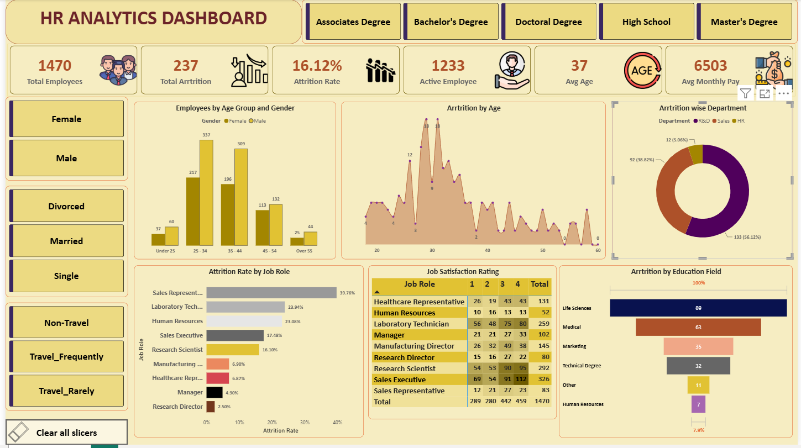

# 📊 HR Analytics Dashboard using Power BI

An interactive **HR Analytics Dashboard** built with **Microsoft Power BI** to analyze employee attrition, workforce demographics, job satisfaction, education, and department-wise performance. This dashboard helps HR teams make data-driven decisions for employee retention and workforce planning.
---
## 📸 Dashboard Preview

---
## 🎯 Project Objectives
- Analyze employee attrition trends.
- Monitor workforce demographics.
- Compare attrition across departments and job roles.
- Analyze employee distribution by age and education.
- Evaluate job satisfaction ratings.
- Support HR decision-making through interactive visualizations.
---
## ✨ Dashboard Features
### 📌 Key Performance Indicators (KPIs)
- Total Employees
- Active Employees
- Total Attrition
- Attrition Rate
- Average Employee Age
- Average Monthly Salary
### 📈 Visualizations
- Employee Distribution by Age & Gender
- Attrition by Department
- Attrition by Age
- Attrition by Job Role
- Attrition by Education Field
- Job Satisfaction Matrix
### 🎛 Interactive Filters
- Gender
- Marital Status
- Education Level
- Business Travel Frequency
---
## 🛠 Technologies Used
| Tool | Purpose |
|------|---------|
| Microsoft Power BI | Dashboard Development |
| Power Query | Data Cleaning & Transformation |
| DAX | Calculated Measures & KPIs |
| Microsoft Excel | Dataset |
---
## 📂 Dataset Information
The dataset includes employee information such as:
- Employee ID
- Age
- Gender
- Department
- Job Role
- Education
- Education Field
- Monthly Income
- Marital Status
- Business Travel
- Job Satisfaction
- Attrition
- Years at Company
---
## 🔄 Project Workflow
```text
Raw HR Dataset
      │
      ▼
Data Cleaning
      │
      ▼
Power Query Transformation
      │
      ▼
Data Modeling
      │
      ▼
DAX Measures
      │
      ▼
Interactive Dashboard
      │
      ▼
Business Insights
```
---
## 📊 Key Insights
- 👥 **Total Employees:** 1,470
- ✅ **Active Employees:** 1,233
- ❌ **Employees Left:** 237
- 📉 **Attrition Rate:** 16.12%
- 🎂 **Average Age:** 37 Years
- 💰 **Average Monthly Salary:** 6,503
### Department Analysis
- R&D has the highest employee attrition.
- Sales is the second-highest contributor.
- HR has the lowest attrition.
### Age Analysis
- Most employees belong to the **25–44** age group.
- Attrition is highest among employees aged **29–33**.
### Job Role Analysis
- Sales Representatives have the highest attrition rate.
- Laboratory Technicians also experience relatively high attrition.
### Education Analysis
- Employees from **Life Sciences** show the highest attrition.
- Medical and Marketing follow.
---
## 💼 Business Impact
This dashboard enables organizations to:
- Identify high-risk employee groups.
- Improve employee retention strategies.
- Support workforce planning.
- Monitor workforce demographics.
- Enable data-driven HR decision-making.
---
## 🚀 Future Improvements
- Predictive Employee Attrition Model
- Employee Performance Dashboard
- Salary Trend Analysis
- Hiring Analytics
- Promotion Analytics
- Real-time Data Integration
- SQL Database Connectivity
---
## 💡 Skills Demonstrated
- Power BI Dashboard Development
- Data Cleaning
- Power Query
- Data Modeling
- DAX
- Data Visualization
- Business Intelligence
- HR Analytics
- KPI Reporting
---
## 📁 Repository Structure
```text
HR-Analytics-Dashboard-PowerBI/
│
├── HR_Analytics_Dashboard.pbix
│
├── HR_Employee_Data.xlsx
│
├── dashboard-overview.png
│
├── README.md
├── LICENSE
└── .gitignore
```
---
## 👨‍💻 Author
**Pradeep Chaudhary**
Aspiring Data Analyst
**Skills:** Power BI • SQL • Python • Excel
---
## ⭐ If you found this project useful, consider giving it a star!
